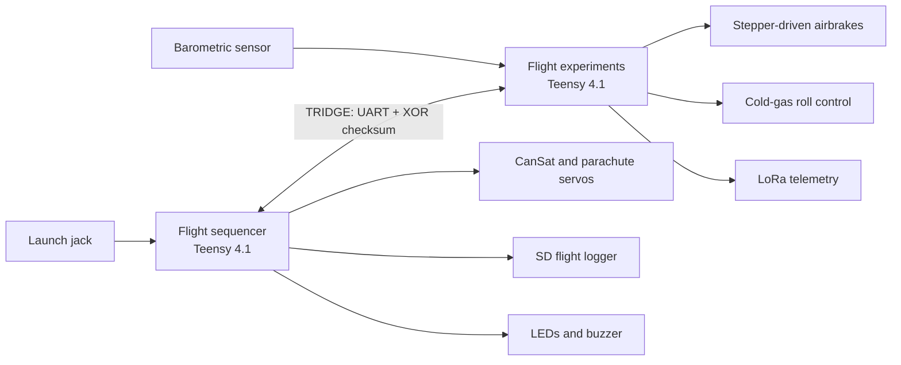

# Polaris Flight Computer


Firmware for **Polaris**, an experimental sounding rocket developed by the Club Aérospatial de CentraleSupélec (CACS) for the C'Space campaign. Two Teensy 4.1 boards coordinate recovery, telemetry, flight-state management, roll control, and airbrakes.

> This repository is a portfolio of embedded-systems work. It is not certified flight software and must not be used for a launch without independent review, testing, and approval by the responsible safety authority.

## Highlights

- Dual-microcontroller architecture with clear recovery and experiments responsibilities.
- Framed, checksummed UART transport for flight state and barometric altitude.
- Non-blocking recovery state machine with SD logging, telemetry, LEDs, buzzer, payload release, and parachute deployment.
- Peak-based barometric apogee detector with motor-burn lockout and drop confirmation.
- Active roll control and projected-apogee airbrake regulation.

## Architecture



| Target | Responsibility | Entry point |
| --- | --- | --- |
| `flight_sequencer` | Launch detection, recovery, flight state, logging and status feedback | `src/flight_sequencer/main.cpp` |
| `flight_experiments` | Barometry, LoRa telemetry, roll control and airbrakes | `src/flight_experiments/main.cpp` |

## Recovery logic

During ascent, the sequencer first evaluates the barometric apogee detector. It tracks peak relative altitude and requires a 3 m loss across five consecutive samples after motor burn. The time-based fallback activates only if apogee has not been detected by **T+17.5 s**. CanSat release and parachute deployment are scheduled with timestamps, preserving logging and communications instead of blocking the main loop.

## Engineering choices

| Concern | Implementation |
| --- | --- |
| Data integrity | Start bytes, fixed-size frames, XOR checksum, and stream resynchronisation |
| Recovery timing | Explicit state machine and `millis()`-based scheduling |
| False apogee triggers | Motor-burn lockout plus peak/drop confirmation |
| Operational visibility | SD logging, LoRa downlink, serial diagnostics, LEDs, and buzzer patterns |
| Actuator safety | Airbrakes retract outside ascent; roll-control valves stop outside active flight |

## Repository layout

```text
include/                         Shared pin maps and configuration values
lib/
  AirbrakeActuator/              Stepper-driven airbrake actuator
  BarometricSensor/              Pressure and altitude acquisition
  BuzzerFeedback/                Non-blocking audible feedback
  FlightControl/                 Roll and airbrake flight program
  FlightData/                    Shared flight packet structures
  FlightDataLogger/              SD-card flight recorder
  FlightState/                   Flight phases and recovery timing
  FlightStatusLeds/              Flight-phase LED feedback
  InterBoardProtocol/            UART transport between the boards
  LoRaRadio/                     LoRa telemetry transport
  RollControl/                   Cold-gas roll controller
  SmartServo/                    ST3215 recovery servos
  StatusLeds/                    NeoPixel driver
  ValveController/               Solenoid-valve driver
src/
  flight_experiments/            Experiments-board firmware
  flight_sequencer/              Sequencer-board firmware
```

## Build

Install [PlatformIO Core](https://docs.platformio.org/en/latest/core/installation/index.html), then:

```bash
git clone <repository-url>
cd polaris-flight-computer

pio run                              # Build both targets
pio run -e flight_sequencer          # Build the sequencer only
pio run -e flight_experiments        # Build the experiments board only
```

To upload, connect the matching Teensy and run `pio run -e <target> -t upload`.

## Verification and contribution

The GitHub Actions workflow builds both PlatformIO environments for pushes and pull requests. A successful build is not flight qualification: safety-critical changes should also be bench-tested, reviewed by peers, and checked against serial and SD logs.

## Portfolio notes

This project demonstrates embedded C++, communication between two real-time controllers, actuator coordination, fault-aware recovery logic, and telemetry/logging integration. Its key design trade-off is giving a filtered sensor event priority over a deterministic time fallback, while keeping a recovery path if the sensor stream is unavailable.

## Credits

Developed within the Club Aérospatial de CentraleSupélec (CACS) for Polaris / Fusex. Credit subsystem ownership and flight-validation work according to the project team's records.
